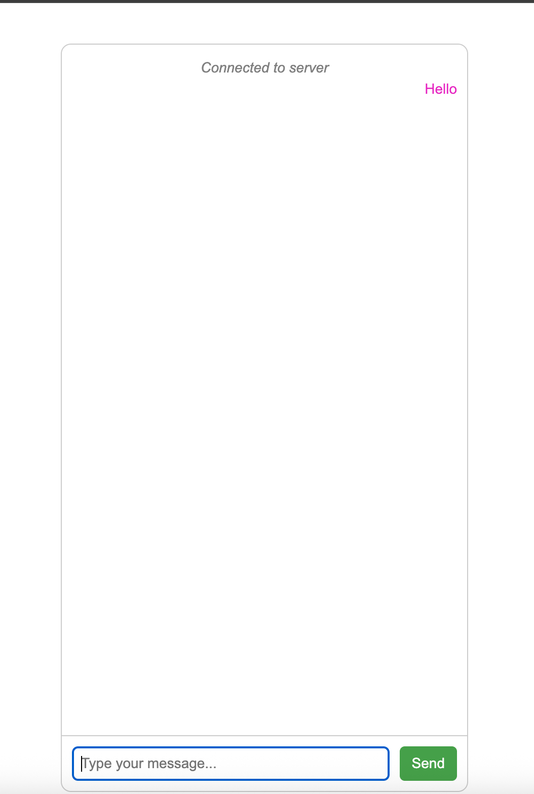
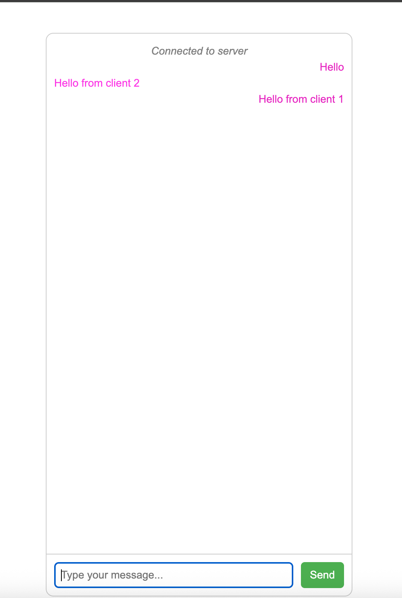
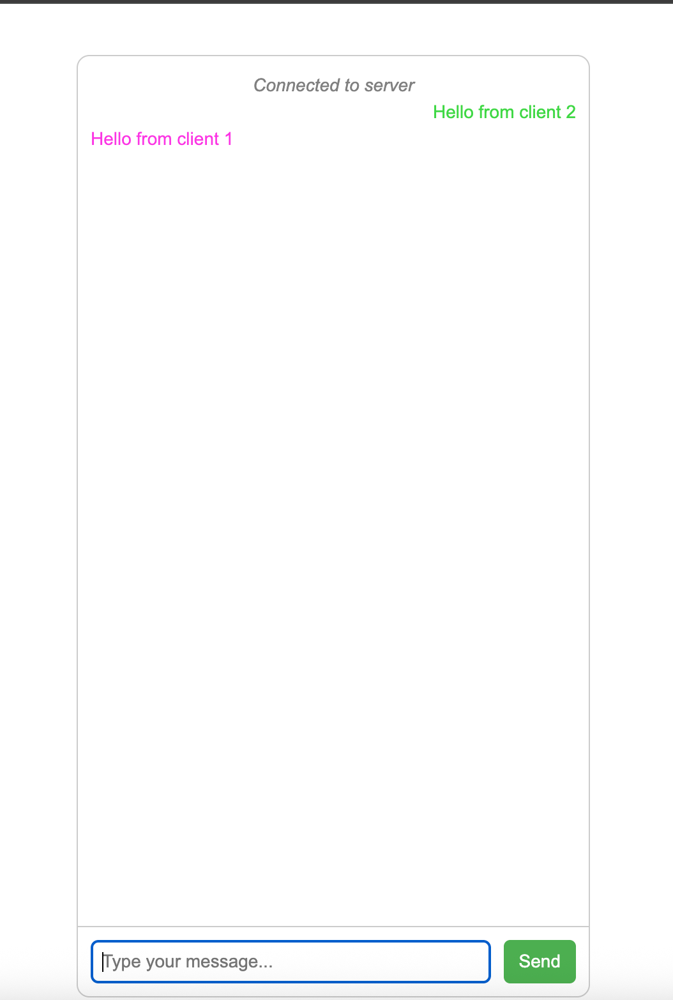

# WSChatServer

**WSChatServer** is a lightweight WebSocket chat server implemented from scratch in Java using only standard libraries. It supports multiple concurrent clients and asynchronous message broadcasting. The project includes a simple HTML/JavaScript client for browser-based chatting.

---

## Features

- Multi-client support with asynchronous communication
- Real-time message broadcasting
- Simple HTML/JS web client
- Dockerized setup for easy deployment

---

## Project Structure

```
.
├── Dockerfile                 # Dockerfile for the WebSocket server
├── docker-compose.yml         # Compose file to run server and client
├── src/
│   └── main/
│       └── resources/
│           └── static/       # HTML/JS client files
└── build.gradle              # Gradle build file (if using Gradle)
```

---

## Running with Docker Compose

1. Make sure Docker and Docker Compose are installed on your machine.
2. Navigate to the project root where `docker-compose.yml` is located.
3. Build and start the containers:

```bash
docker-compose up --build -d
```

4. Check running containers:

```bash
docker ps
```

5. Access the chat client in your browser:

```
http://localhost
```

6. The WebSocket server runs at:

```
ws://localhost:8081/socket
```

---

## Usage

- Open multiple browser tabs to `http://localhost` to simulate multiple clients.
- Type a message in the input box and press **Enter** or click **Send**.
- Messages are broadcast to all connected clients in real-time.
- Each client can have a unique color for sent messages.

---

## Sample Screenshots

**Chat Client (Single User)**


**Chat Client (Multiple Users)**
<div style="display: flex; gap: 10px;">
  
  
</div>

---

## Notes

- Server uses Java `ExecutorService` and `BlockingQueue` for concurrent handling of clients.
- Messages are broadcast asynchronously to all connected clients.
- HTML client is served via a lightweight Nginx container.

---

## License

Specify your license here (e.g., MIT, Apache 2.0)

